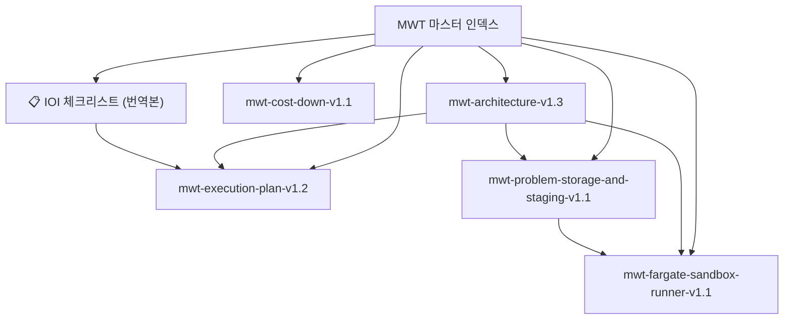

---
aliases:
  - MWT Index
  - MWT Hub
tags:
  - mwt
  - hub
  - index
  - obsidian
doc_type: hub
status: active
updated: 2026-04-28
---

# MWT 마스터 인덱스

> [!abstract] 이 노트의 역할
> MWT 관련 설계 문서의 허브다. 처음 읽을 문서, 현재 기준 버전, 문서 간 관계를 한 곳에서 본다.

## 현재 기준 문서

| 영역 | 문서 | 역할 |
| --- | --- | --- |
| 기준 아키텍처 | [[mwt-architecture-v1.3]] | 전체 시스템 구조와 운영 원칙 |
| 실행 계획 | [[mwt-execution-plan-v1.2]] | 실제 구현/운영 태스크 |
| 저장/스테이징 | [[mwt-problem-storage-and-staging-v1.1]] | 메타, 자산, bundle, manifest, `/tmp` 전략 |
| 샌드박스 러너 | [[mwt-fargate-sandbox-runner-v1.1]] | Fargate 기반 judge 실행 제어 설계 |
| 비용 절감안 | [[mwt-cost-down-v1.1]] | 개인 프로젝트 기준 비용 절감 전략 |
| 참고 자료 | [[📋 IOI 체크리스트 (번역본)]] | 운영/리허설 관점 참고 |

## 폴더 구조

```text
mwt/
  00 Hub/
    MWT 마스터 인덱스
    MWT Dataview 대시보드
  10 Architecture/
    mwt-architecture-v1.3
    mwt-cost-down-v1.1
    mwt-problem-storage-and-staging-v1.1
  20 Execution/
    mwt-execution-plan-v1.2
  30 Judge Runtime/
    mwt-fargate-sandbox-runner-v1.1
  90 References/
    📋 IOI 체크리스트 (번역본)
```

## 추천 읽는 순서

1. [[mwt-architecture-v1.3]]
2. [[mwt-problem-storage-and-staging-v1.1]]
3. [[mwt-fargate-sandbox-runner-v1.1]]
4. [[mwt-execution-plan-v1.2]]
5. [[mwt-cost-down-v1.1]]

## 현재 합의된 핵심 원칙

> [!summary] 핵심
> - 메타는 DynamoDB
> - 자산은 S3
> - hidden tests는 bundle
> - 실행은 Fargate `/tmp` staging
> - judge는 Fargate + sandbox runner
> - 상태 전이와 structured log를 운영 기준으로 관리
> - 구현 후 반드시 리허설과 장애 주입 테스트 수행

## 바로 확인할 체크포인트

- [ ] statement는 S3 기준으로 통일되어 있는가
- [ ] hidden tests는 bundle + manifest 기준으로 관리되는가
- [ ] worker는 개별 파일 fetch가 아니라 bundle preload를 쓰는가
- [ ] timeout, output limit, cleanup이 runner에 반영되는가
- [ ] bundle 변경 시 manifest/problem version 절차가 문서화되어 있는가
- [ ] 무한루프, sleep 무한대기, worker 중간 종료 리허설이 계획에 들어가 있는가
- [ ] `system_error` 재처리와 rejudge 절차가 운영 문서에 들어가 있는가

## 문서 관계



## Obsidian 활용 팁

> [!tip] 추천 사용 방식
> - 이 노트를 북마크하거나 Home 노트처럼 사용
> - 그래프 뷰에서 `#mwt` 태그만 필터링
> - 속성 보기에서 `status`, `doc_type`, `version` 기준으로 정렬
> - 새 문서는 역할에 맞는 하위 폴더에 생성
> - 나중에 프로젝트 관리가 필요하면 Dataview로 문서 목록 자동화 가능
